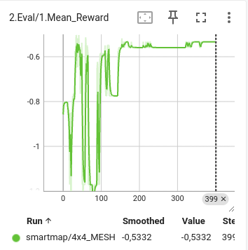

# SmartMap: Architecture-Agnostic CGRA Mapping using Graph Traversal and Reinforcement Learning
SmartMap is a framework that utilizes an actor-critic reinforcement learning method applied to Monte-Carlo Tree Search (MCTS) to learn how to map a DFG onto a CGRA. This framework offers full portability by using a state-action representation layer in the policy network, instead of a probability distribution over actions. Moreover, it integrates a graph traversal placement method to enhance scalability and improve the efficiency of MCTS by enabling more effective exploration during the search.

## Summary
- [Paper](#paper)
- [Next Steps](#next-steps)
- [Project Structure](#project-structure)
- [Setup](#setup)
	- [Machine Configuration](#machine-configuration)
	- [Prerequisites](#prerequisites-tested-on-the)
	- [Install the Dependencies](#install-the-dependencies)
- [Hyperparameters](#hyperparameters)
	- [Pre-training](#pre-training)
	- [Mapping](#mapping)
- [Results](#results)
	- [Pre-training](#pre-training-1)
		- [Visualise All Pre-Training Results](#visualise-all-pre-training-results)
	- [Mapping](#mapping-1)
		- [Example of an Interpretable Mapping](#example-of-an-interpretable-mapping)
- [Workflow](#workflow)
	- [Scripts information](#scripts-information)
	- [Pre-training](#1-pre-training)
	- [Mapping](#2-mapping)
		- [Zero-shot](#zero-shot)
		- [Finetune](#finetune)

## Paper
Accepted.

## Next steps
Since the code runs slowly for experiments with 8×8 and 16×16 configurations, we are improving its efficiency by optimizing the code and using C++ in the new version. Additionally, we are implementing new baselines, conducting further experiments, and providing a training script to maximize the potential of SmartMap, i.e., enabling training on any DFG and CGRA.  

## Project Structure
The structure of this project is organized as follows:
* **benchmarks**: This directory contains all collected benchmarks. `benchmarks/changed_MCTS_benchmark` contains the DFGs used for mapping, and `benchmarks/synthetics` contains the DFGs used for pre-training;
* **configs**: All configurations for the experiments, including hyperparameters;
* **results**: Tracked metrics for pre-training, interpretable mappings, checkpoints, images, and CSVs with information about the mapping and pre-training results;
* **scripts**: Shell scripts to facilitate reproducibility and the use of the code;
* **src**: All source code;

## Setup
### Machine Configuration
The experiments were performed on:
* Ubuntu 24.04.1 LTS
* GPU: 4GB NVIDIA GeForce RTX 3050
    * Driver Version: 550.107.02     
    * CUDA Version: 12.4
* 16 CPUs: 11th Gen Intel(R) Core(TM) i7-11800H @ 2.30GHz

### Prerequisites
* Python 3.12.3
* PIP 24.0

### Install the Dependencies

Install the dependencies before running the code:
1. `git clone https://github.com/lesc-ufv/SmartMap.git && cd smart_map`
2. `chmod +x setup.sh && ./setup.sh`


## Hyperparameters
The following tables present the main hyperparameters used, along with their values and a brief description. It's important to note that **SelfMapping** in train mode refers to a mapping where the agent does not always take greedy actions, whereas **SelfMapping** in test mode performs mapping in a greedy manner, i.e., without exploration. In zero-shot mapping, only test mode is utilized.

### Pre-Training

| Hyperparameter  | Description   | Value Type | Used Value |
|:---------------|:-------------:|:----------:|-----------:|
| epochs         | Number of epochs during pre-training | int | 400 |
| iters | Number of times to train on all batches | int | 3 |
| batch size     | Number of samples to train in each step | int | 64 |
| clip           | Clip value | float | 0.2 |                
| initial_lr     | Initial learning rate | float | 1e-3 |
| optimizer      | Optimizer | torch.optim | AdamW |
| decay_step     | Number of epochs before decaying the learning rate | int | 1 |
| decay_rate     | Rate to decay the learning rate | float | 0.99 |
| weight entropy loss | Weight of entropy loss in the objective function | float | Starts at 0.1 and decreases to 0.01 as training advances |
| weight kl      | Weight of KL loss in the objective function | float | Adjusted dynamically |
| weight value   | Weight of value loss in the objective function | float | 1 |

### Mapping

| Variable Name  | Description    | Value Type | Used Value |
|:---------------|:--------------:|:----------:|-----------:|
| batch_size | Batch size during training in finetune mapping | int | 32 |
| checkpoint_interval | Number of training steps before updating the model weights in SharedStorage | int | 1 |
| device | Device to train the model | String | cuda |
| discount | Discount factor | float | 0.997 |
| lr_decay_rate | Decay rate of the learning rate | float | 0.95 |
| lr_decay_steps | Steps to decay the learning rate exponentially | int | 100 |
| lr_init | Initial learning rate | float | 0.01 |
| max_moves | Max number of placement actions if mapping does not finish before | int | Number of PEs |
| momentum | Optimizer parameter | float | 0.9 |
| num_max_expansion_test | Max number of children to expand during the expansion stage in SelfMapping during test mode | int | 100 |
| num_max_expansion_train | Max number of children to expand during the expansion stage in SelfMapping during train mode | int | 200 |
| num_simulations | Number of MCTS simulations | int | Vary according to the architecture size and interconnection style. See `src/utils/util_configs_train.py` |
| num_unroll_steps | Number of placement actions to keep in a batch for each mapping sample | int | Number of PEs |
| num_workers | Number of SelfMapping instances running in parallel in train mode | int | 10 |
| optimizer | Optimizer for the model | String | "Adam" |
| pb_c_base | UCB constant 2 according to MuZero equation in the MCTS selection step | float | 19652 |
| pb_c_init | UCB constant 1 according to MuZero equation in the MCTS selection step | float | 1.25 |
| PER | Whether to use prioritized replay | bool | False |
| PER_alpha | Degree of prioritization | float | 1 |
| ratio | Ratio of training to mappings | float | Starts at 1/5 and decreases to 1/1 as training advances |
| reanalyse_on_gpu | Whether Reanalyse will use the GPU | bool | False |
| replay_buffer_size | Number of mappings to maintain in the buffer | int | 64 |
| root_dirichlet_alpha | Parameter for Dirichlet distribution to create noise | float | 0.25 |
| root_exploration_fraction | Proportion of noise to use in root prior node | float | 0.25 |
| seed | Seed for NumPy and PyTorch | int | 1234 |
| selfplay_on_gpu | Whether SelfMapping will use the GPU | bool | False |
| self_play_delay | Time that SelfMapping waits before generating a mapping again | float | 0.0 |
| training_delay | Time that Trainer waits before training the model again | float | 0.0 |
| td_steps | Temporal difference steps | int | Starts at 25% of CGRA size and increases as training advances |
| training_steps | Max number of training steps during finetune mapping | int | 500 |
| train_on_gpu | Whether training will be done on the GPU | bool | True |
| use_last_model_value | Whether to use the last model's weights in Reanalyse | bool | True |
| value_loss_weight | Weight for value loss during training | float | 1.0 |
| visit_softmax_temperature_fn | Function to update the stochasticity during action selection in SelfMapping in train mode | function | See `utils/SoftmaxTemperature.py` |
| weight_decay | Optimizer parameter | float | 0.0001 |

## Results

This section presents how to access our results and provides a brief description of them.

### Pre-Training

For pre-training, the following metrics were tracked: policy loss, value loss, entropy loss, KL divergence loss, total loss, learning rate during training, and mean reward during evaluation. Moreover, all checkpoints can be found in `results/checkpoints/`, and the training time is recorded in `results/train_results.csv`.
Finally, Figure 1 shows the mean reward obtained by SmartMap in a mesh-like 4x4 CGRA.

**Figure 1**


#### Visualise All Pre-Training Results
In the root directory of the project, run the following command and follow the instructions:
```bash
tensorboard --logdir results/
```

### Mapping
For mappings, information such as whether the mapping is valid, routing penalty (sum of all rewards of the mapping), test mode (zero-shot or finetune), reason for unsuccessful mapping (if applicable), and mapping time are stored in `mapping_results.csv`, while interpretable mappings are provided in `results/mappings/`. Note that MCTS metrics are also saved and will be used for further analysis.

#### Example of an Interpretable Mapping
This section presents the result of mapping onto a 4x4 mesh-like CGRA for DFG V_8_E_9.

**DFG V_8_E_9**


**Mapping**

Timing can be understood as scheduling. 
```
-------------------------------------------------- Mapping V_8_E_9.dot --------------------------------------------------

Successful Mapping | Routing Penalty: -0.08999999821186067 | Mapping Time: 1.312 sec | Num Simulations: 200
Solution found before finish the MCTS simulations.

Placement and Timing:
[PE | Placed DFG node or routing PE (R) | Scheduled Time]

	[0  | -1   | t = -1 ]  [1  | add5 | t = 3  ]  [2  | add4 | t = 2  ]  [3  | add3 | t = 1  ] 
	[4  | -1   | t = -1 ]  [5  | -1   | t = -1 ]  [6  | add7 | t = 1  ]  [7  | add6 | t = 0  ] 
	[8  | -1   | t = -1 ]  [9  | add2 | t = 3  ]  [10 | add1 | t = 2  ]  [11 | add0 | t = 1  ] 
	[12 | -1   | t = -1 ]  [13 | -1   | t = -1 ]  [14 | -1   | t = -1 ]  [15 | -1   | t = -1 ] 

Routing:
(Source PE, Destination PE) | Routing path passing through PEs: [Source PE, PE_x, ..., PE_y,Destination PE]

	(10, 9)  | [10, 9] 
	(11, 10) | [11, 10]
	(7, 11)  | [7, 11] 
	(7, 6)   | [7, 6]  
	(6, 10)  | [6, 10] 
	(6, 2)   | [6, 2]  
	(7, 3)   | [7, 3]  
	(3, 2)   | [3, 2]  
	(2, 1)   | [2, 1]  

MCTS results: Mean visited rate: 54.993% | Mean visited nodes: 127.500 | 2xMean expanded nodes: 1.892 | Mean max tree depth 7.000 | Number of Backtrackings: 0

-------------------------------------------------- End Mapping V_8_E_9.dot --------------------------------------------------
```


## Workflow
The workflow is simple:
1. Pre-train a model on `synthetics` DFGs and save the checkpoint in `results/checkpoints/`.
2. Map DFGs in `changed_MCTS_benchmark/` with zero-shot and finetune using the pre-trained model.

### Scripts Information
The scripts for pre-training and mapping follow this pattern:
```bash
<script> <ConfigFile> <ConfigClass> <ARCH_STYLE> <nxm>
```

Where *n* and *m* can be any positive integer values, *ARCH_STYLE* can be OH_TOR_DIAG, MESH, or ONE_HOP. *ConfigFile* is the filename of a configuration in `configs/` for a compiler, and *ConfigClass* is the class in this configuration file. The *script* refers to any script in `scripts/`.


### 1. Pre-Training
```scripts/train.sh config_smartmap.py ConfigSmartMap MESH 4x4```

### 2. Mapping
#### Zero-shot
```scripts/map_with_zero_shot.sh config_smartmap.py ConfigSmartMap MESH 4x4```
#### Finetune
```scripts/map_with_finetune.sh config_smartmap.py ConfigSmartMap MESH 4x4```


